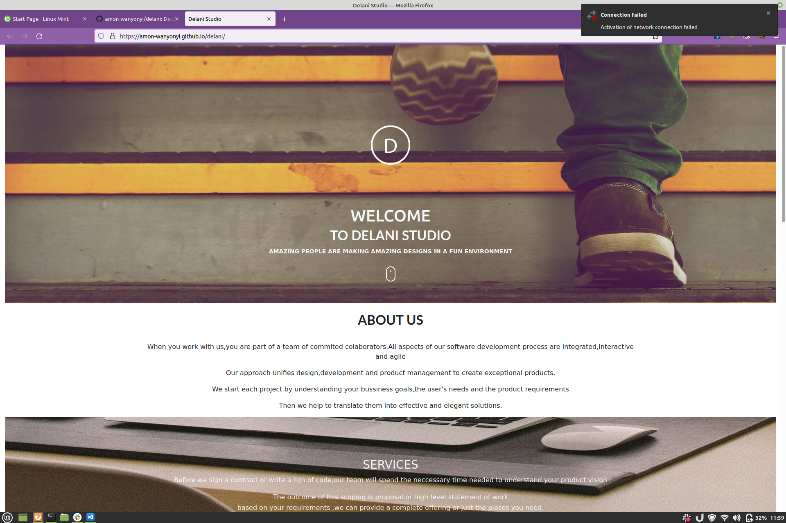
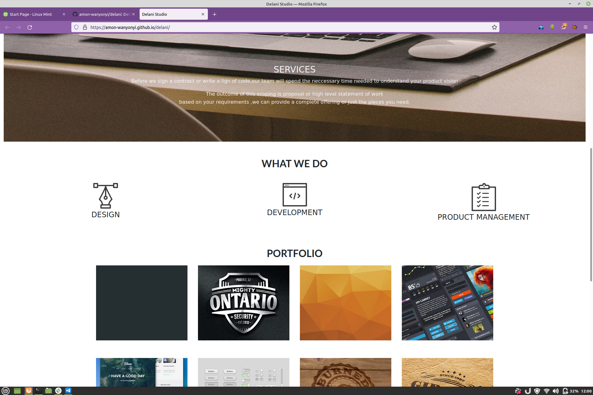
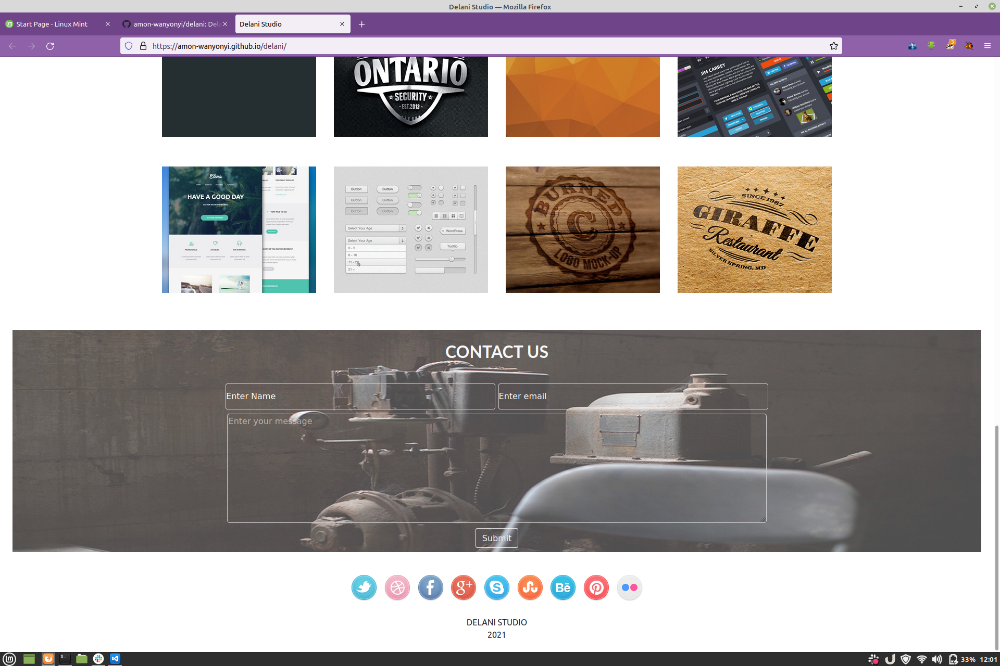

# DELANI - STUDIO
## Author
#### Amon Wanyonyi
## Description
##### This project isa web application for Delani studio that gives the details of what services offered there.
##### The site has information about the studio, a portfolio section and a form through which you can send   message to the Delani studio management.
## Screenshots

## Live link for Delani studio :
[Click the link to Delani Studio Website](https://amon-wanyonyi.github.io/delani/)
## Installation Instructions
* Ctrl+Alt+T to open the terminal
* cd to the directory you want the delani directory to be located
* git clone https://github.com/amon-wanyonyi/delani
* cd delani
* Open with your favorite IDE
  ## Technologies Used
  - HTML5
  - JQuery
  - JavaScript
  - CSS
  - Bootstrap
  - Markdown
  ## Known Bugs
  Bugs with the mail chimp but was fixed
  ## Contact Information
  For questions, to hire me or contribution, please contact me:  
  xxx110680@gmail.com 